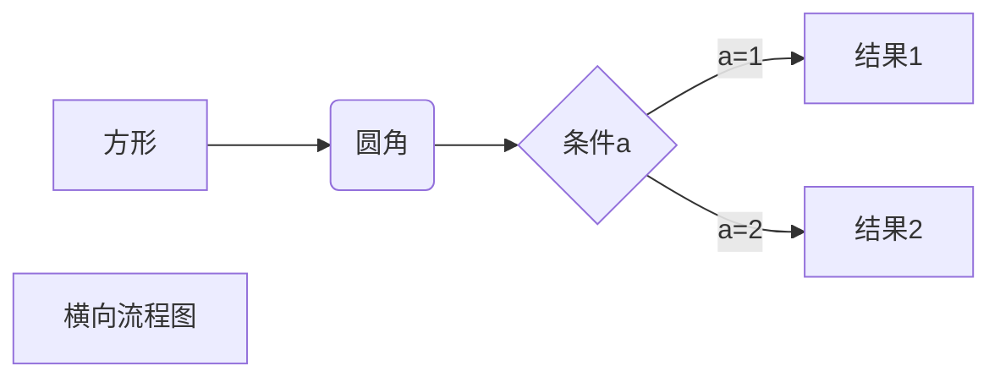

# 免费申请IBM VPS一年免费继续用

自从谷歌2020年8月份开始从原来365天的免费试用的正常变更为90天的试用后，看看是否有其他更好的替代薅羊毛方案！

今天我们讲3个方面的内容

1. 我们利用开源免费的Cloud Foundry项目来搭建V2ray；
2. IBM Cloud Foundry 10天没有操作的话就是关机，所以利用Github来每周开关机一次避免关机；
3. cloudflare worker项目来给V2ray加速；

完成第一部分 就可以使用了，如果进阶可以继续完成第二 第三部分
让我们开始吧！

### 1. 我们利用开源免费的Cloud Foundry项目来搭建V2ray

##### 1.1. 申请IBM免费VPS
> 地址：https://cloud.ibm.com/

##### 1.2. V2ray一键安装代码

```
wget --no-check-certificate -O install.sh https://raw.githubusercontent.com/CCChieh/IBMYes/master/install.sh && chmod +x install.sh  && ./install.sh

```

> 注意事项：
>> 1. 记住填写的 应用名称 建议写：bigfang 
>> 2. 内存大小选择256m
>> 3. 一键安装完成后 保存生成VMESS链接

##### 1.3. 客户端配置

倒入vmess链接

### 2. 利用Github创建每周开关机一次任务

##### 2.1. 项目地址
> https://github.com/CCChieh/IBMyes
在项目里点击Fork，这样就复制程序到自己的Github里面

##### 2.2. 建立4项secret

> IBM_ACCOUNT // IBM Cloud的登录邮箱和密码
```
your@email.com  
password
```
> IBM_APP_NAME // 应用的名称
```
bigfang
```

> REGION_NUM // 区域编码
```
7
```

> RESOURSE_ID // 资源组ID
```
你的ID
```

>> 如何查找RESOURSE_ID？
>>> *打开IBM cloud shell，输入下面代码*

```
ibmcloud resource groups
```
 >>> *显示出来的ID就是你的RESOURSE_ID*
 
 
##### 2.3. 运行IBM项目

###### 2.3.1. 点击Actions，再点击绿色的框  
###### 2.3.2. 再点击Code--github/workflows---ibm.yml--右边的编辑按钮 修改一下第37行  
修改完点击start commit。
再回到Actions就能看到正在运行的项目，等到变成绿色的对号就运行了

### 3. cloudflare加速

登陆Cloudflare官网点击workers--创建--复制脚本--修改对应域名

```
addEventListener(
"fetch",event => {
let url=new URL(event.request.url);
url.hostname="ibmyes.us-south.cf.appdomain.cloud";
let request=new Request(url,event.request);
event. respondWith(
fetch(request)
)
}
)
```

点击“发送”出现Bad Request表示成功！
这时候会给一个网址，..workers.dev域名,这是cloudflare中转的域名

### 4. 客户端配置


